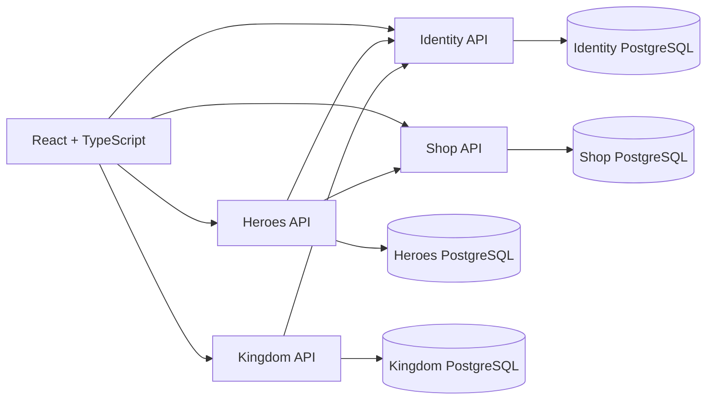

# 🛡️ Foreveryone

Foreveryone es un RPG web de gestión y progresión idle (*management/idle game*). Los jugadores pueden registrarse, crear héroes, combatir, fundar reinos, producir recursos, mejorar edificios, entrenar tropas y comprar equipo.

El repositorio contiene una SPA React y cuatro servicios ASP.NET Core independientes. Cada servicio aplica una separación por contextos con capas `Api`, `Application`, `Domain` e `Infrastructure`, y utiliza su propio contexto de persistencia PostgreSQL.

> **Estado actual:** el proyecto es un MVP funcional en desarrollo. El backend y el frontend compilan, pero la aplicación todavía no debe exponerse públicamente sin resolver la autenticación/autorización, la configuración de producción y los riesgos descritos más abajo.

## 📑 Tabla de contenido

- [Características](#-características)
- [Arquitectura](#-arquitectura)
- [Tecnologías](#-tecnologías)
- [Estructura del repositorio](#-estructura-del-repositorio)
- [Requisitos previos](#-requisitos-previos)
- [Configuración local](#-configuración-local)
  - [1. Crear las bases de datos](#1-crear-las-bases-de-datos)
  - [2. Configurar las APIs](#2-configurar-las-apis)
  - [3. Ejecutar el backend](#3-ejecutar-el-backend)
  - [4. Ejecutar el frontend](#4-ejecutar-el-frontend)
- [Endpoints principales](#-endpoints-principales)
- [Comandos útiles](#-comandos-útiles)
- [Agentes de OpenCode](#-agentes-de-opencode)
- [Estado y limitaciones conocidas](#-estado-y-limitaciones-conocidas)
- [Solución de problemas](#-solución-de-problemas)
- [Roadmap](#-roadmap)

## ✨ Características

- Registro e inicio de sesión con JWT, usando nombre de usuario o email.
- Elección de raza y clase obligatoria antes de entrar al juego.
- Creación de héroes de cuatro clases combinables con cuatro razas.
- Combate por turnos con daño basado en ataque y defensa.
- Experiencia, niveles y estadísticas permanentes.
- Descanso y recuperación de vida.
- Creación y gestión de reinos.
- Producción pasiva de recursos basada en tiempo, con un máximo de dos horas acumulables.
- Construcción y mejora de edificios.
- Entrenamiento de soldados y cálculo de poder militar.
- Catálogo de objetos y compras que modifican al héroe.
- Swagger/OpenAPI disponible para cada API en el entorno de desarrollo.

## 🏛️ Arquitectura



### Microservicios

| Servicio | Responsabilidad | Persistencia | Puerto HTTP local |
| --- | --- | --- | ---: |
| **Identity** | Registro, login, hash de contraseñas, emisión de JWT y verificación de usuarios | `IdentityDbContext` | `5045` |
| **Heroes** | Héroes, combate, experiencia, descanso, oro y compras | `HeroesDbContext` | `5281` |
| **Kingdom** | Reinos, recursos, edificios, mejoras y ejército | `KingdomDbContext` | `5256` |
| **Shop** | Catálogo de objetos y sus efectos | `ShopDbContext` | `5136` |

Los servicios se comunican de forma síncrona mediante HTTP. El frontend llama directamente a cada API; actualmente no existe un API Gateway.

### Capas de cada servicio

```text
ForEveryone.[Service].Api
├── Controllers
├── Program.cs y configuración de DI
└── Composition root

ForEveryone.[Service].Application
├── Commands y queries
├── MediatR
├── DTOs e interfaces
└── Validación

ForEveryone.[Service].Domain
├── Entidades y agregados
├── Value objects
└── Reglas de negocio

ForEveryone.[Service].Infrastructure
├── EF Core y DbContext
├── Repositorios
├── Clientes HTTP
└── Migraciones
```

`ForEveryone.SharedKernel` contiene abstracciones compartidas como `Entity`, `Result`, `Error`, comandos, queries y eventos de dominio. En la implementación actual, Identity es el servicio que utiliza de forma más consistente el Shared Kernel.

## 🛠️ Tecnologías

### Backend

- .NET 10
- ASP.NET Core Web API
- C#
- Entity Framework Core
- PostgreSQL mediante Npgsql
- MediatR
- FluentValidation
- JWT con `System.IdentityModel.Tokens.Jwt`
- PBKDF2-SHA256 para contraseñas
- Swagger/OpenAPI

### Frontend

- React 19
- TypeScript 6
- Vite 8
- React Router DOM 7
- Axios
- CSS puro con tema dark fantasy
- ESLint

## 📂 Estructura del repositorio

```text
Foreveryone/
├── .opencode/
│   └── agents/                       # Agentes de OpenCode
├── ForEveryone - backend/
│   ├── ForEveryone.slnx
│   ├── setup-shop.ps1
│   ├── start-all.ps1
│   └── src/
│       ├── BuildingBlocks/
│       │   └── ForEveryone.SharedKernel/
│       └── Services/
│           ├── Identity/
│           ├── Heroes/
│           ├── Kingdom/
│           └── Shop/
├── foreveryone-frontend/
│   ├── src/
│   │   ├── api/
│   │   ├── components/
│   │   ├── pages/
│   │   ├── App.tsx
│   │   └── types.ts
│   ├── package.json
│   └── vite.config.ts
└── readme.md
```

## ✅ Requisitos previos

- [.NET 10 SDK](https://dotnet.microsoft.com/download/dotnet/10.0)
- Node.js `^20.19.0` o `>=22.12.0`
- npm
- PostgreSQL local o en Docker, con una versión compatible con Npgsql
- PowerShell si se desea ejecutar `start-all.ps1`

Comprueba las versiones instaladas:

```powershell
dotnet --version
node --version
npm --version
psql --version
```

## ⚙️ Configuración local

### 1. Crear las bases de datos

El proyecto utiliza un contexto y una base de datos por servicio. Crea cuatro bases vacías:

```sql
CREATE DATABASE foreveryone_identity;
CREATE DATABASE foreveryone_heroes;
CREATE DATABASE foreveryone_kingdom;
CREATE DATABASE foreveryone_shop;
```

En desarrollo, cada API aplica sus migraciones automáticamente al arrancar. Fuera de `Development`, las migraciones deben ejecutarse como parte de un proceso explícito de despliegue.

### 2. Configurar las APIs

No guardes contraseñas ni secretos JWT en Git. Para desarrollo local se recomienda usar **.NET User Secrets**.

#### Identity

Desde `ForEveryone - backend`:

```powershell
Push-Location src/Services/Identity/ForEveryone.Identity.Api

dotnet user-secrets set "ConnectionStrings:IdentityDb" "Host=localhost;Port=5432;Database=foreveryone_identity;Username=postgres;Password=TU_PASSWORD"
dotnet user-secrets set "Jwt:Secret" "CAMBIAR_POR_UN_SECRETO_LARGO_Y_ALEATORIO"
dotnet user-secrets set "Jwt:Issuer" "ForEveryone.Identity"
dotnet user-secrets set "Jwt:Audience" "ForEveryone.Clients"
dotnet user-secrets set "Jwt:ExpirationMinutes" "60"

Pop-Location
```

#### Heroes

```powershell
Push-Location src/Services/Heroes/ForEveryone.Heroes.Api

dotnet user-secrets set "ConnectionStrings:HeroesDb" "Host=localhost;Port=5432;Database=foreveryone_heroes;Username=postgres;Password=TU_PASSWORD"
dotnet user-secrets set "IdentityServiceUrl" "http://localhost:5045/"
dotnet user-secrets set "ShopServiceUrl" "http://localhost:5136/"

Pop-Location
```

#### Kingdom

```powershell
Push-Location src/Services/Kingdom/ForEveryone.Kingdom.Api

dotnet user-secrets set "ConnectionStrings:KingdomDb" "Host=localhost;Port=5432;Database=foreveryone_kingdom;Username=postgres;Password=TU_PASSWORD"
dotnet user-secrets set "IdentityServiceUrl" "http://localhost:5045/"

Pop-Location
```

#### Shop

```powershell
Push-Location src/Services/Shop/ForEveryone.Shop.Api

dotnet user-secrets set "ConnectionStrings:ShopDb" "Host=localhost;Port=5432;Database=foreveryone_shop;Username=postgres;Password=TU_PASSWORD"

Pop-Location
```

### 3. Ejecutar el backend

Abre una terminal diferente para cada API o ejecuta el script de arranque.

Desde `ForEveryone - backend`:

```powershell
dotnet restore ForEveryone.slnx
dotnet build ForEveryone.slnx --no-restore
```

Identity:

```powershell
dotnet run --project src/Services/Identity/ForEveryone.Identity.Api --launch-profile http
```

Heroes:

```powershell
dotnet run --project src/Services/Heroes/ForEveryone.Heroes.Api --launch-profile http
```

Kingdom:

```powershell
dotnet run --project src/Services/Kingdom/ForEveryone.Kingdom.Api --launch-profile http
```

Shop:

```powershell
dotnet run --project src/Services/Shop/ForEveryone.Shop.Api --launch-profile http
```

#### Script de arranque

También existe `start-all.ps1`:

```powershell
cd "ForEveryone - backend"
.\start-all.ps1
```

> El script abre cada proceso en una ventana de PowerShell y contiene una ruta absoluta para el frontend. Revísala antes de utilizarla en otro equipo.

### 4. Ejecutar el frontend

Desde la raíz del repositorio:

```powershell
cd foreveryone-frontend
npm ci
npm run dev
```

Abre:

```text
http://localhost:5173
```

El frontend actual usa las URLs locales definidas en `foreveryone-frontend/src/api/api.ts`. Aunque existe un archivo `.env`, el código todavía no consume `import.meta.env`; por ello, sus variables no cambian las URLs en tiempo de ejecución.

## 🔌 Endpoints principales

### Identity — `http://localhost:5045`

| Método | Ruta | Descripción |
| --- | --- | --- |
| `POST` | `/api/auth/register` | Registra un usuario |
| `POST` | `/api/auth/login` | Inicia sesión y devuelve un JWT |
| `GET` | `/internal/users/{id}/exists` | Comprueba la existencia de un usuario |

Cuerpos de	request y respuestas:

```jsonc
// POST /api/auth/register
// { "username": "ainz.ooal", "email": "gmail@example.com", "password": "Password1" }
// 201 -> { "userId": "...", "username": "ainz.ooal", "email": "gmail@example.com" }

// POST /api/auth/login
// { "identifier": "ainz.ooal", "password": "Password1" }
// 200 -> { "token": "...", "userId": "...", "username": "ainz.ooal", "email": "gmail@example.com" }
```

`identifier` admite email o nombre de usuario. El backend decide cuál usar según
el formato recibido: si contiene `@` se busca por email, en caso contrario por
nombre de usuario. El nombre de usuario se normaliza a minúsculas, por lo que
`Ainz.Ooal` y `ainz.ooal` son la misma cuenta.

Reglas del nombre de usuario:

- Entre 3 y 24 caracteres.
- Solo letras, números, punto, guion y guion bajo.
- Debe empezar y terminar en letra o número.
- Es único y da lugar a un `409 Conflict` si ya está en uso.

El JWT incluye el claim estándar `preferred_username` con el nombre de usuario,
además de `sub` y `email`. El frontend lo decodifica en `UserSession` para mostrar
el nombre del jugador.

### Heroes — `http://localhost:5281`

| Método | Ruta | Descripción |
| --- | --- | --- |
| `POST` | `/api/heroes` | Crea un héroe con su raza y clase |
| `GET` | `/api/heroes/options` | Catálogo de razas y clases con sus estadísticas |
| `GET` | `/api/heroes/{userId}` | Obtiene el héroe de un usuario. Devuelve `404` si todavía no tiene |
| `POST` | `/api/heroes/{userId}/adventure` | Ejecuta una aventura |
| `POST` | `/api/heroes/{userId}/rest` | Recupera la vida del héroe |
| `GET` | `/api/shop` | Catálogo legado mantenido en Heroes |
| `POST` | `/api/shop/{userId}/buy` | Compra un objeto desde el servicio Heroes |

#### Creación del personaje

Tras iniciar sesión, un usuario sin héroe ve un asistente a pantalla completa
donde elige primero la raza y después la clase. La navegación del juego no
aparece hasta que el personaje existe. `GameGate` es el componente que hace
esta comprobación en el frontend: consulta únicamente a Heroes
(`GET /api/heroes/{userId}`) y deriva al asistente si responde `404`.

Deliberadamente **no** consulta a Identity en este punto. Hacerlo obligaba a que
el login dependiera de dos servicios a la vez, y cualquier fallo transitorio de
Identity bloqueaba el juego con un mensaje de sesión inválida justo después de
iniciar sesión. Si la cuenta realmente no existe, el propio `POST /api/heroes`
devuelve `404` y el asistente ofrece cerrar sesión.

```jsonc
// POST /api/heroes
// { "userId": "...", "race": 3, "class": 1 }
// 201 -> { "heroId": "...", "userId": "...", "race": "Enano", "class": "Warrior" }
```

Cada usuario tiene como máximo un héroe. La elección es inmutable: no existe
endpoint para cambiarla, y un segundo `POST` devuelve `409`.

**Estadísticas base por clase** (`ClassBonus.For`):

| Clase | Vida | Ataque | Defensa | Maná |
| --- | --- | --- | --- | --- |
| `Warrior` | 150 | 15 | 20 | 10 |
| `Hunter` | 100 | 20 | 10 | 20 |
| `Wizard` | 80 | 25 | 5 | 50 |
| `Rogue` | 90 | 18 | 12 | 15 |

**Modificadores por raza** (`RaceBonus.For`), en porcentaje sobre la clase:

| Raza | Vida | Ataque | Defensa | Maná |
| --- | --- | --- | --- | --- |
| `Humano` | 0% | 0% | 0% | 0% |
| `Elfo` | 0% | +10% | -10% | +10% |
| `Enano` | +20% | -10% | +20% | 0% |
| `Orco` | +15% | +15% | -15% | -20% |

El cálculo se aplica una sola vez, dentro del constructor de `Hero`, de modo
que ningún héroe puede existir sin el bonus de su raza. El porcentaje usa
división entera truncada hacia cero y nunca baja de 1 punto, así que un
penalizador no deja una estadística inutilizable.

Las dos tablas de balance viven solo en el dominio. El frontend las recibe de
`GET /api/heroes/options` y reproduce el mismo cálculo para la vista previa, en
lugar de duplicar los números.

### Kingdom — `http://localhost:5256`

| Método | Ruta | Descripción |
| --- | --- | --- |
| `POST` | `/api/kingdoms` | Crea un reino |
| `GET` | `/api/kingdoms/{userId}` | Obtiene el reino y calcula recursos pendientes |
| `POST` | `/api/kingdoms/{userId}/buildings` | Construye un edificio |
| `POST` | `/api/kingdoms/{userId}/buildings/upgrade` | Mejora un edificio |
| `POST` | `/api/kingdoms/{userId}/army/train` | Entrena soldados |

### Shop — `http://localhost:5136`

| Método | Ruta | Descripción |
| --- | --- | --- |
| `GET` | `/api/shop` | Lista el catálogo |
| `GET` | `/api/shop/{id}` | Obtiene un objeto concreto |

### Swagger

En `Development`, la interfaz Swagger está disponible en:

```text
http://localhost:5045/swagger
http://localhost:5281/swagger
http://localhost:5256/swagger
http://localhost:5136/swagger
```

## 🧰 Comandos útiles

### Backend

```powershell
# Restaurar paquetes
dotnet restore ForEveryone.slnx

# Compilar
dotnet build ForEveryone.slnx --no-restore

# Publicar una API
dotnet publish src/Services/Heroes/ForEveryone.Heroes.Api -c Release
```

### Frontend

```powershell
# Instalar exactamente las versiones del lockfile
npm ci

# Servidor de desarrollo
npm run dev

# Comprobar ESLint
npm run lint

# Compilar TypeScript y Vite
npm run build

# Previsualizar el build
npm run preview
```

## 🤖 Agentes de OpenCode

El proyecto incluye agentes reutilizables en `.opencode/agents/`:

- `reviewer.md`: revisión sin acceso de edición.
- `tester.md`: pruebas, diagnóstico y verificación.
- `code-explorer.md`: análisis de arquitectura y código.
- `documentation-writer.md`: creación y mantenimiento de documentación.

Ejemplos de uso desde OpenCode:

```text
Usa el agente code-explorer para mapear el flujo de compra de la tienda.
```

```text
Usa el agente reviewer para revisar los cambios actuales sin modificar archivos.
```

## ⚠️ Estado y limitaciones conocidas

- **Autorización pendiente:** Identity emite JWT, pero Heroes, Kingdom y Shop no configuran actualmente `AddJwtBearer`, `UseAuthentication` ni `[Authorize]`. No confíes en el `userId` enviado por el cliente hasta resolverlo.
- **Endpoint interno público:** `/internal/users/{id}/exists` no requiere autenticación entre servicios.
- **Lint frontend pendiente:** `npm run lint` conserva errores existentes de tipos `any` y parámetros sin usar en `src/api/api.ts` y `src/pages/CastlePage.tsx`.
- **Configuración frontend desacoplada:** las variables del archivo `.env` todavía no se utilizan y las URL de API están fijadas en `src/api/api.ts`.
- **Sin pruebas automatizadas:** no hay proyectos de tests .NET ni una suite de frontend.
- **Sin CI/CD ni contenedores:** todavía no hay Dockerfiles, Docker Compose ni workflows de despliegue.
- **Sin health checks ni observabilidad:** no hay endpoints de salud, métricas, trazas distribuidas ni correlación de requests.
- **Manejo global de errores pendiente:** algunos errores de dominio pueden terminar como respuestas HTTP 500. En Heroes solo se traducen `NotFoundException`, `ConflictException` y `ValidationException` desde los controladores; otras excepciones, como la falta de oro en una compra, siguen escapando sin manejar.
- **Concurrencia pendiente:** las operaciones de compra, recursos y entrenamiento no tienen tokens de concurrencia optimista.
- **CORS local:** los orígenes permitidos se configuran por servicio en `Cors:AllowedOrigins` dentro de `appsettings.json`. Por defecto se admiten `localhost` y `127.0.0.1` en los puertos `5173` y `5174`.

## 🛠️ Solución de problemas

### La API no encuentra una connection string

Verifica que estés ejecutando la API correcta y que el secreto exista. Ejecuta este comando desde el proyecto `.Api` correspondiente:

```powershell
dotnet user-secrets list
```

Los nombres de configuración son sensibles a mayúsculas y minúsculas.

### `new Uri(...)` falla al arrancar

Configura las URLs de servicios con una URL absoluta válida:

```text
IdentityServiceUrl=http://localhost:5045/
ShopServiceUrl=http://localhost:5136/
```

### Error de conexión con PostgreSQL

Comprueba que:

1. PostgreSQL esté ejecutándose.
2. Las cuatro bases existan.
3. El usuario y la contraseña sean correctos.
4. El firewall permita conexiones locales al puerto `5432`.
5. La API esté ejecutándose con `ASPNETCORE_ENVIRONMENT=Development` si esperas que aplique migraciones.

### CORS desde el frontend

Los orígenes permitidos se leen de `Cors:AllowedOrigins` en el `appsettings.json` de cada API. Por defecto se admiten `localhost` y `127.0.0.1` en los puertos `5173` y `5174`:

```jsonc
"Cors": {
  "AllowedOrigins": [
    "http://localhost:5173",
    "http://localhost:5174",
    "http://127.0.0.1:5173",
    "http://127.0.0.1:5174"
  ]
}
```

Si el navegador muestra un error de CORS, comprueba primero en qué puerto está
sirviendo Vite. `foreveryone-frontend/vite.config.ts` fija el puerto `5173` con
`strictPort`, de modo que si está ocupado Vite avisa en lugar de arrancar en
otro puerto. Para permitir un origen adicional, edita la lista en el
`appsettings.json` del servicio correspondiente y reinícialo.

### La tienda no conecta con Shop

Verifica que Shop esté escuchando en `http://localhost:5136` y que `Heroes` tenga configurado:

```text
ShopServiceUrl=http://localhost:5136/
```

## 🗺️ Roadmap

1. Eliminar los errores de lint restantes y ampliar la cobertura de pruebas.
2. Implementar validación JWT y autorización en todos los servicios.
3. Obtener `userId` desde claims en lugar de confiar en el cuerpo o la URL.
4. Sustituir URLs fijas por configuración validada para Vite.
5. Unificar el contrato y el catálogo de Shop entre frontend, Heroes y Shop.
6. Añadir manejo global de errores y contratos `ProblemDetails`.
7. Crear pruebas unitarias, de integración y de contrato.
8. Añadir concurrencia optimista y límites de valores de dominio.
9. Incorporar health checks, logging estructurado y trazabilidad.
10. Dockerizar el sistema y definir un pipeline de CI/CD.
11. Completar la tienda y el inventario de objetos.
12. Evaluar combate PvP y asedios entre reinos.

---

Foreveryone es un proyecto activo y en evolución. Las funcionalidades no deben marcarse como aptas para producción hasta completar la autenticación, las pruebas y el endurecimiento operativo.
